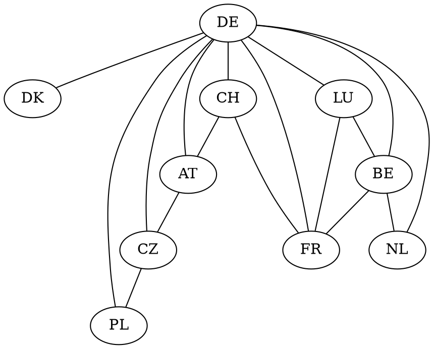
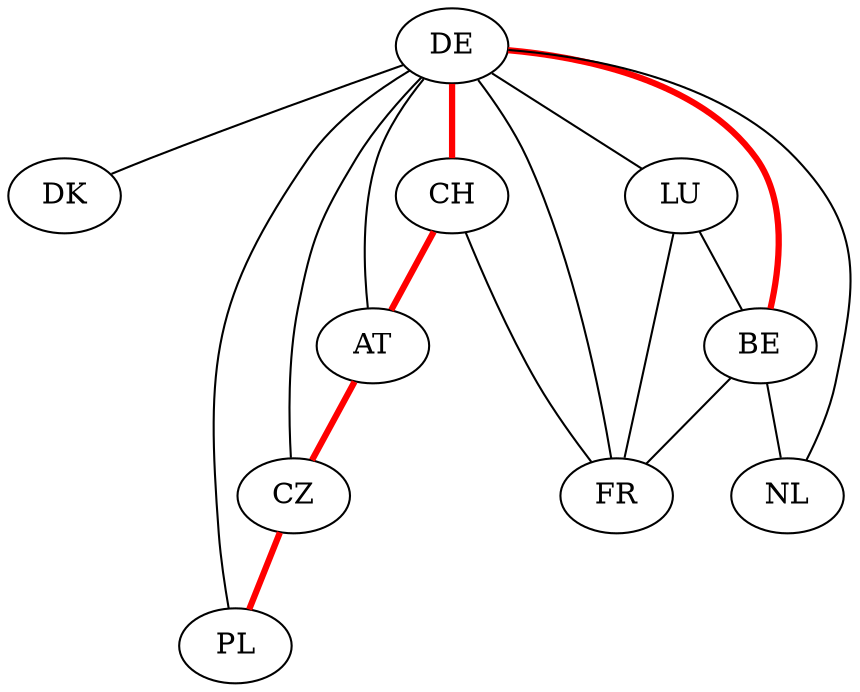
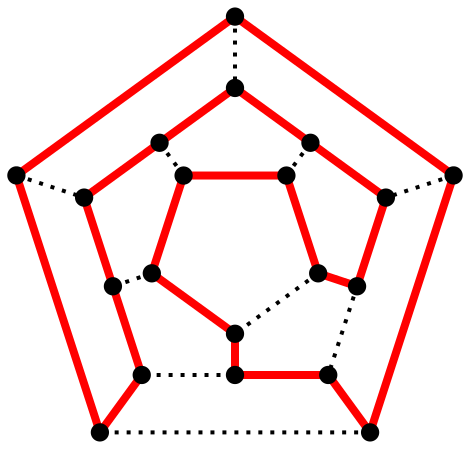
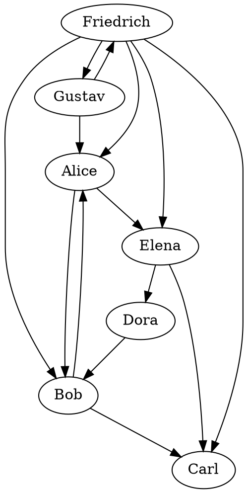
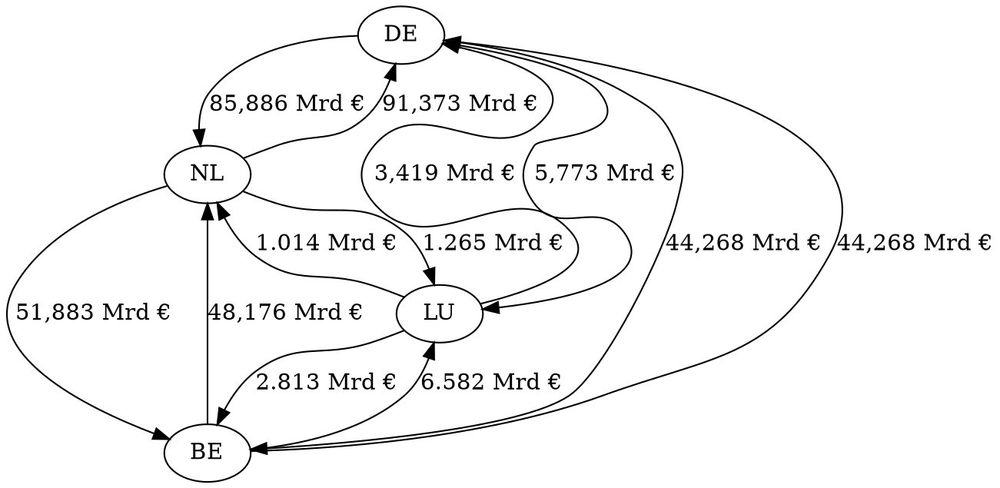

# Graphen: Einführung

Graphen sind eine Datenstruktur, mit der komplexe Beziehungen zwischen Daten dargestellt werden können.

## Terminologie

Ein Graph besteht aus *Kanten* und *Knoten* (engl.: *Vertex* und *Edge*).
Im obrigen Beispiel sind als Knoten Deutschland und seine Nachbarländer zu sehen.
Als Kante bezeichnet man die Verbindung zweier Knoten, im Beispiel die gemeinsamen Grenzen.

Man kann durch einen Graphen einen *Pfad* legen.
Dieser beschreibt eine bestimmte Reihenfolge, in dem man die einzelnen Knoten besucht.
Eine Reise-Route von Belgien nach Polen über die Schweiz könnte zum Beispiel der Pfad $BE \rightarrow DE \rightarrow CH \rightarrow AT \rightarrow CZ \rightarrow PL$ sein.

## Besondere Pfade

### Euler-Tour, Euler-Pfad

Eine *Euler-Tour* ist ein Pfad, der jeden Kante des Graphen genau ein mal besucht.
Damit eine Euler-Tour zugleich ein *Euler-Pfad* ist, müssen Anfangs- und Endknoten verbunden sein.

Ein Euler-Pfad durch das *Haus des Nikolaus*:

Ein Graph besitzt eine Euler-Tour, wenn alle Knoten eine gerade Kardinalität, also eine gerade Anzahl an anliegenden Kanten, besitzen.

### Hamilton-Zyklus

Ein *Hamilton-Zyklus* ist ein Pfad, der jeden Knoten des Graphen einmal enthält.

Jede Euler-Tour ist zugleich ein *Hamilton-Zyklus*.
Im Gegensatz zur Euler-Tour, die sich leicht finden lässt, ist das finden eines Hamilton-Zyklus' NP-vollständig.

## Gerichtete Graphen

Eine Kante verbindet zwei Punkte.
Wenn sie zusätzlich eine Richtung enthält, in der sie verbindet, spricht man von einem *gerichteten* Graphen.

Dieser Graph stellt ein kleines soziales Netwerk dar.
Eine Kante $A \rightarrow B$ bedeutet hier "A folgt B",
im Beispiel folgt *Gustav* also *Friedrich* und *Alice*.

Ein gerichteter Graph darf nur gerichtete Kanten enthalten, ein ungerichteter Graph nur ungerichtete.
Eine ungerichtete Kante lässt sich immer durch zwei gerichtete Kanten zwischen den beiden Knoten übersetzen.

## Gewichtete Kanten

Man kann Graphen um eine Gewichtung einzelner Kanten erweitern.
Dann kann eine Kante neben der Information, welche beiden Knoten miteinander verbunden sind, auch zusätzliche Informationen speichern.

In diesem Graph sieht man zum Beispiel die Handelsvolumina zwischen den Deutschland, Belgien, Luxemburg und den Niederlanden.

## TL;DR

Graphen bestehen aus *Knoten* und *Kanten*, die jeweils zwei Knoten mit einander verbinden.
Enthalten die Kanten Richtungsinformationen, so spricht man von einem *gerichteten* Graphen.
Speicher die Kanten Werte, so spricht man von einem *gewichteten* Graphen.

Mit Graphen kann man einfach komplexe Beziehungen, zum Beispiel ein soziales Netzwerk oder eine Karte, darstellen.
